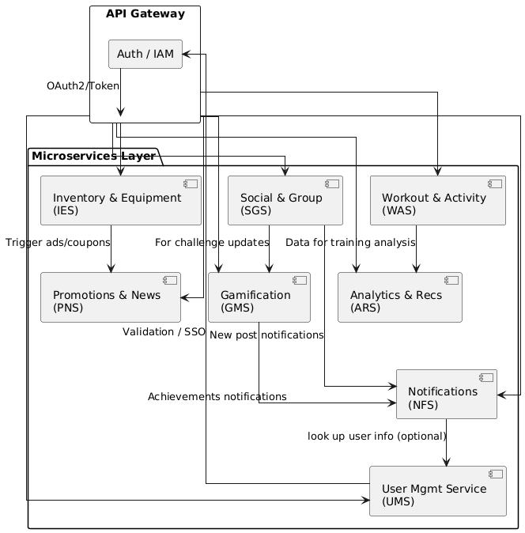
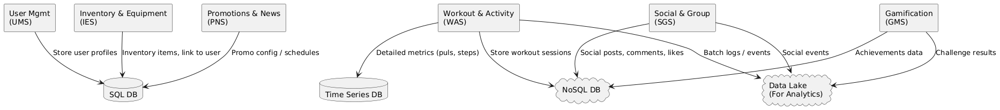
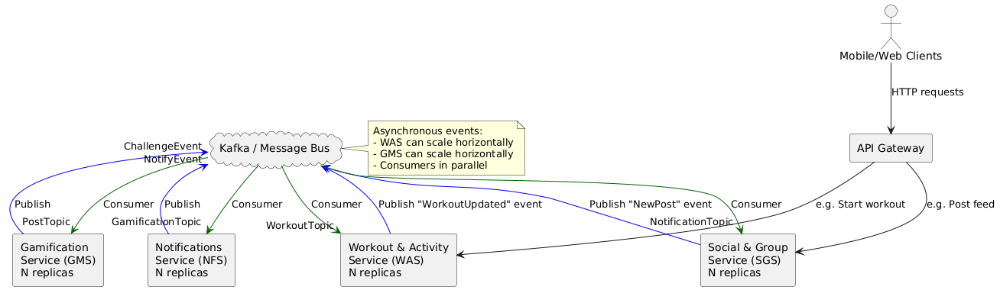
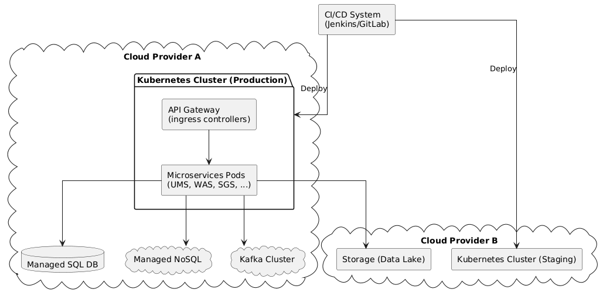
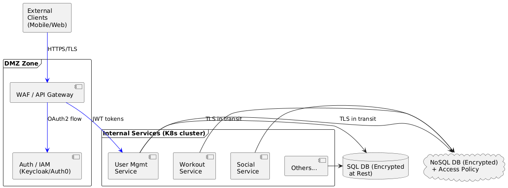

# 14. Описание основных представлений (viewpoints) архитектуры

Ниже представлено **детальное описание основных представлений** (viewpoints) архитектуры:

1. **Функциональное (Functional)**
2. **Информационное (Information/Data)**
3. **Многозадачность / параллелизм (Concurrency)**
4. **Инфраструктурное (Infrastructure/Deployment)**
5. **Безопасность (Security)**

Каждое представление описывает архитектуру с определённой точки зрения, чтобы разные участники проекта (аналитики, разработчики, сетевые инженеры, специалисты по безопасности) могли лучше понимать устройство и поведение системы.

## A. Функциональное представление

### 1. Общая идея

Функциональное представление показывает **основные модули или сервисы** приложения и их назначение. Задача этого вида — описать, *что делает* система с точки зрения отдельных блоков и их взаимодействий по логике.

**Цель**: дать понимание, как распределены обязанности (responsibilities) между подсистемами и какие связи существуют между ними.

### 2. Ключевые компоненты (пример)

1. **User Management Service (UMS)**
   - Регистрация, авторизация, профили.
   - Обеспечивает управление учётными записями, настройку приватности.
2. **Workout & Activity Service (WAS)**
   - Фиксация тренировок, учёт показателей (дистанция, время, пульс, калории).
   - Формирование статистики и сравнений с предыдущими результатами.
3. **Social & Group Service (SGS)**
   - Группы по интересам, публикации, комментарии, лента активности.
   - Социальные взаимодействия, поиск единомышленников.
4. **Gamification Service (GMS)**
   - Механика челленджей, ачивок, очков, рейтингов.
   - Мотивация пользователей, удержание и интерес к приложению.
5. **Inventory & Equipment Service (IES)**
   - Учёт экипировки (пробег обуви, срок использования снаряжения).
   - Рекомендации по обновлению товаров, связи с e-commerce.
6. **Promotions & News Service (PNS)**
   - Управление промоакциями, скидками, новостями спорта.
   - Таргетированное отображение в зависимости от региона и интересов.
7. **Notifications Service (NFS)**
   - Отправка уведомлений (push, email, SMS).
   - Сигналы о новых достижениях друзей, старте челленджа.
8. **Analytics & Recommendations (ARS)**
   - Персональные рекомендации (планы тренировок, товары).
   - Аналитика по данным, машинное обучение.

### 3. Взаимодействие и данные

- Межсервисные вызовы (REST/gRPC) обрабатываются через **API Gateway**.
- Каждый сервис выполняет свою *функциональную обязанность* и обращается к другим сервисам/базам данных при необходимости.

## B. Информационное представление

### 1. Общая идея

Информационное (или **data view**) описывает, **какие данные** есть в системе, **как** они хранятся, **какие** потоки данных существуют между сервисами и **как** эти данные трансформируются.

**Цель**: отразить структуру информационных объектов (датчики, метрики, профили, соцпосты) и зависимости между ними.

### 2. Основные сущности (пример)

1. **Пользователь (User)**
   - Идентификатор, личные данные (имя, email), настройки приватности.
   - Связанные объекты: профиль тренировок, группы, инвентарь.
2. **Тренировка (Workout)**
   - Тип (бег, йога), дата/время, длительность, дистанция, метрики (пульс, калории).
   - Хранение показателей может быть распределено (в NoSQL или Time Series DB).
3. **Сообщения и посты (SocialPost, Comment)**
   - Текст, прикреплённые медиа, автор, дата, лайки.
   - Связь «пост — комментарии — лайки».
4. **Инвентарь / экипировка (Equipment)**
   - Модель, тип товара, дата покупки, пробег (для обуви).
   - Может содержать ссылку на товар в магазине.
5. **Челлендж / ачивки (Challenge, Achievement)**
   - Условия достижения (пробежать 50 км за неделю), сроки, награды (виртуальные очки).
   - Ассоциация к конкретному пользователю или группе.
6. **Акции, промо (Promotion)**
   - Тип (скидка, новость), дата начала/окончания, регион, список поддерживаемых товаров.

### 3. Структура хранения (пример)

- **Реляционная БД (SQL)**: профили пользователей, заказы, финансовые данные.
- **NoSQL** (MongoDB/DynamoDB): посты и лента активности (гибкая схема), тренировки в объёмах большого масштаба.
- **Time Series DB** (InfluxDB, TimescaleDB): показания пульса, скорости, шагов по времени.
- **Data Lake**: сырые логи, события, big data для ML.

### 4. Потоки данных

- **События тренировок** (из IoT Hub к WAS): сохраняются в NoSQL, а затем копируются в Data Lake для аналитики.
- **Соцданные** (SGS) — хранятся и обрабатываются там же (NoSQL) с возможным кэшированием.
- **Рекомендации** (ARS): читает агрегированные данные из Data Lake / Time Series, отдаёт результат в сервис.

## C. Многозадачность (Concurrency)

### 1. Общая идея

Конкурентность (параллелизм) описывает, **как** система обрабатывает множественные запросы от разных пользователей, **как** организованы очереди, потоки, механизм управления нагрузкой.

**Цель**: обеспечить производительность и корректную работу при большом числе параллельных обращений.

### 2. Основные схемы параллелизма

1. **Микросервис + контейнер**:
   - Каждый сервис может масштабироваться (реплики в Kubernetes).
   - Внутри сервиса — многопоточность (например, thread pool HTTP-сервера), но это скрыто за фреймворками (Spring Boot, Node.js, Go и т.п.).
2. **Message-driven / event-driven**
   - Для асинхронной логики (например, обработка телеметрии, геймификационные события) используется очередь/шина (Kafka, RabbitMQ).
   - Сервисы-«потребители» (consumers) получают сообщения и обрабатывают их параллельно (в рамках своих инстансов).
3. **Управление конкурентным доступом к данным**
   - В реляционных БД: механизмы транзакций, уровни изоляции.
   - В NoSQL: оптимистичные блокировки, версии документов, механизмы Conflict Resolution (в зависимости от СУБД).

### 3. Пики нагрузки

- При массовых челленджах тысячи пользователей одновременно стартуют тренировку:
  - API Gateway + Autoscaling микросервисов принимают HTTP-запросы.
  - IoT Hub получает всплеск событий; данные распределяются по очереди Kafka, откуда WAS и ARS потребляют их асинхронно.

### 4. Реализация concurrency-паттернов

- **Circuit Breaker / Retry** (Resilience4j, Istio): если сервис перегружен, временно «замораживает» запросы, чтобы не перегрузить систему.
- **Bulkhead**: ограничение ресурсов на конкретный сервис / пул потоков, чтобы сбой одной части системы не уронил все сервисы.

## D. Инфраструктурное представление (Deployment / Infrastructure)

### 1. Общая идея

Инфраструктурный вид (deployment view) описывает, **где** и **как** развёрнуты компоненты приложения: серверы, кластеры, балансировщики, сети, CD/CI, окружения (Dev, Staging, Prod).

**Цель**: показать физические или виртуальные узлы и то, как они связаны сетью.

### 2. Развёртывание (пример)

1. **Kubernetes Cluster**
   - Несколько кластеров (Prod, Staging, Dev), каждый может быть в одном или нескольких облаках (AWS, Azure, GCP, Yandex...).
   - Микросервисы в виде Pod'ов (каждый сервис — набор реплик).
   - Ингресс-контроллер (NGINX, Traefik, Istio Gateway) для маршрутизации внешнего трафика.
2. **API Gateway**
   - Может быть развернут как отдельный сервис (Kong, Ambassador, Tyk) или настроен через Istio ingress.
   - Находится в DMZ (демилитаризованной зоне), принимает внешние запросы, проводит аутентификацию, передаёт внутрь кластера.
3. **Базы данных**
   - **SQL** (PostgreSQL, MySQL, Aurora в AWS, Azure SQL) и **NoSQL** (MongoDB Atlas, DynamoDB, Cassandra) располагаются в облаках.
   - Реплики/шарды по регионам для отказоустойчивости и снижения задержек.
   - Time Series DB (InfluxDB, Timescale) либо в том же кластере, либо как управляемый сервис.
4. **IoT Hub**
   - Развёрнут в облаке (AWS IoT, Azure IoT) или как самостоятельный модуль (EMQX, HiveMQ).
   - Принимает данные от устройств, передаёт в очередь / микросервис WAS.
5. **Big Data / ML**
   - **Data Lake** (S3, Azure Data Lake, GCS) для хранения больших объёмов сырых данных.
   - **Аналитические кластеры** (EMR, Dataproc или Spark on Kubernetes), Kafka-кластер (Confluent Cloud / MSK / on-prem).
   - Модели (MLflow, SageMaker, Azure ML, Vertex AI) развёртываются как отдельные сервисы, вызываемые ARS.
6. **CI/CD**
   - GitLab CI, Jenkins, GitHub Actions для сборки и тестов.
   - Артефакты (Docker-образы) публикуются в контейнерный Registry (DockerHub, ECR, ACR, GCR).
   - Автоматический деплой в Kubernetes (Helm, Argo CD, Flux).

## E. Безопасность (Security)

### 1. Общая идея

Security view показывает **механизмы аутентификации**, **авторизации**, **защиты данных** (в покое и в движении), **конфиденциальности** (privacy) и **управления ключами**.

**Цель**: продемонстрировать, как реализованы требования GDPR/локальных законов, как защищены запросы, и каким образом контролируется доступ.

### 2. Основные аспекты безопасности

1. **Аутентификация и авторизация**
   - Использование **OAuth2/OpenID Connect** (Keycloak, Auth0, Amazon Cognito и др.).
   - JSON Web Token (JWT) для передачи информации о пользователе между сервисами.
   - Разграничение ролей (пользователь, админ группы, модератор).
2. **Шифрование**
   - **TLS** (HTTPS) для всех внешних соединений (Mobile/Web -> Gateway).
   - Шифрование данных в покое (encryption at rest) с помощью KMS или встроенных механизмов облачной БД (AES-256).
   - Опционально - клиентское шифрование особо чувствительных полей (доступ только у владельца).
3. **Механизмы приватности**
   - Пользователь сам выбирает, кто видит его результаты тренировок, локацию, и т.д.
   - Возможность экспорта/удаления своих данных (GDPR «Right to be forgotten»).
4. **Защита API**
   - **API Gateway** проводит проверку токенов, рейт-лимитинг, WAF (Web Application Firewall) может защитить от SQL-инъекций, XSS и пр.
   - Каждая вызова внутри микросервисной среды проверяется (service-to-service auth), если предусмотрен Zero Trust.
5. **Логирование и аудит**
   - Запись всех действий с учётными записями, важными данными (кто когда изменил персональную информацию, запустил тренировку и т.д.).
   - Система мониторинга (SIEM) ищет аномалии, подозрительные паттерны трафика.
6. **Управление уязвимостями**
   - Регулярные обновления контейнеров, сканирование образов (Snyk, Trivy) на уязвимости.
   - Penetration testing, bug bounty-программы.

Ниже для каждого из **5 представлений** (функциональное, информационное, многозадачность, инфраструктурное, безопасность) приводятся **примерные схемы**.
Эти схемы условные и могут быть адаптированы под реальные названия сервисов/баз данных/решений в конкретном проекте.

## 1. Функциональное представление

### Идея схемы

- Отображаем **основные микросервисы** (User, Workout, Social, Gamification, Inventory, Promotions, Notifications, Analytics).
- Показываем, как они связаны **логически** (кто к кому обращается).
- Один из вариантов: все внешние запросы идут через **API Gateway**, а микросервисы могут вызывать друг друга напрямую или через события.

**Пояснения**:

- Все внешние запросы от мобильных и веб-клиентов проходят через **API Gateway**, который взаимодействует с микросервисами.
- **User Mgmt Service (UMS)** отвечает за профили и базовую авторизацию (при необходимости обращается к Auth/IAM).
- **Workout & Activity Service (WAS)** хранит данные о тренировках, может запрашивать у **Analytics & Recs (ARS)** инсайты.
- **Social & Group Service (SGS)** ведёт ленту, группы; при некоторых событиях задействует **Gamification (GMS)**, чтобы обновить рейтинги, или шлёт уведомления через **Notifications (NFS)** и т.д.

## 2. Информационное представление

### Идея схемы

- Показываем **основные сущности** (User, Workout, SocialPost, Equipment, Promotion), где они хранятся (SQL, NoSQL, TimeSeries).
- Можно подчеркнуть потоки данных (кто куда пишет/читает).

**Пояснения**:

- **User profiles** и транзакционные данные (заказы, биллинг и т.д.) находятся в **SQL**.
- **Workouts** (общая структура) и **Social** (соцпосты, лайки, комментарии) храним в **NoSQL**.
- Подробные метрики (пульс по секундам, GPS-треки) — в **Time Series DB**.
- Для дальнейшей аналитики (Big Data, ML) всё (в том числе события) складываем в **Data Lake**.

## 3. Многозадачность (Concurrency) представление

### Идея схемы

- Отображаем **поток** входящих запросов (HTTP), **событийную шину** (Kafka или RabbitMQ), а также параллельные **консьюмеры**.
- Указываем, как микросервисы масштабируются и как они обрабатывают сообщения.

**Пояснения**:

- **Clients** шлют HTTP-запросы в **API Gateway**, который распределяет их по микросервисам.
- Микросервисы при важных событиях (окончание тренировки, публикация поста, изменение статуса челленджа) **публикуют** событие в **Kafka** (либо другую шину).
- Любой сервис, которого это касается, **подписывается** (consumer) на соответствующий топик и обрабатывает его.
- Каждый сервис **масштабируется** (N replicas), обрабатывая запросы/сообщения параллельно.

## 4. Инфраструктурное представление

### Идея схемы

- Показываем кластеры, узлы, облака, CI/CD, базу данных как управляемый сервис.

**Пояснения**:

- Различные **облачные провайдеры** (Cloud Provider A, Cloud Provider B).
- В **Cloud A** находится **продакшен-кластер** Kubernetes, управляемые БД, Kafka (как сервис) и т.д.
- В **Cloud B** может быть **staging**-кластер и/или Data Lake.
- **CI/CD** отвечает за сборку и деплой в оба кластера.
- **Microservices** (UMS, WAS, SGS, GMS...) развернуты внутри Kubernetes, общаются с внешними сервисами (SQL, NoSQL, Kafka) и при необходимости с **Data Lake**.

## 5. Безопасность (Security) представление

### Идея схемы

- Показываем **Auth / Identity Provider**, **TLS**, **WAF**, внутренние и внешние зоны, шифрование данных.

**Пояснения**:

- **DMZ Zone** содержит **API Gateway** (проверяет входящий трафик, может быть защищён WAF) и **Auth/IAM** сервис.
- Все внешние подключения идут только **по HTTPS**.
- **JWT-токены** (или аналог) используются для передачи информации об авторизации внутри микросервисов.
- **SQL и NoSQL** базы **зашифрованы** в покое, а доступ к ним тоже идёт **по защищённому каналу (TLS)**.
- Можно упомянуть, что есть **role-based access control** (RBAC) внутри кластера, и политики сети (NetworkPolicy в Kubernetes) запрещают доступ из вне к базам напрямую.

---

Таким образом, мы имеем **5 разных схем** (по одному на каждое представление), позволяющих взглянуть на архитектуру с разных сторон:

1. **Функциональное представление** — какие микросервисы есть, какие задачи решают, как обмениваются данными (через Gateway).
2. **Информационное представление** — какие основные сущности (User, Workout, Post и пр.), в каких типах БД хранятся, как формируются потоки данных.
3. **Многозадачность (Concurrency)** — как обрабатываются параллельные запросы/события (Kafka, масштабирование, реплики).
4. **Инфраструктурное** — где и как развёрнуты кластеры, базы, Data Lake, CI/CD, провайдеры облака.
5. **Безопасность** — аутентификация (OAuth2/OpenID Connect), HTTPS/TLS, WAF, шифрование в покое (энкриптированные БД).

Эти схемы — всего лишь **пример**, который можно **доработать** (добавить конкретные названия сервисов, IP-блоки, сертификаты, конкретные протоколы), но в таком виде уже даёт ясное **визуальное представление** о ключевых аспектах архитектуры.

## Заключение

- **Функциональное** представление описывает сервисы и их назначение.
- **Информационное** даёт понимание, какие данные где хранятся и как перемещаются.
- **Многозадачность (Concurrency)** рассказывает, как система обрабатывает параллельные запросы, шины сообщений, синхронные/асинхронные механизмы.
- **Инфраструктурное** показывает физическое (или виртуальное) размещение сервисов и баз, сетевую связность, CI/CD-пайплайн и кластеризацию.
- **Безопасность** отвечает на вопросы о шифровании, аутентификации, авторизации, privacy-настройках и защите API.

Такое разделение на **5 представлений** даёт максимально полную картину архитектуры приложения, покрывая ключевые аспекты — от бизнес-логики и структуры данных до инфраструктуры и безопасности.
