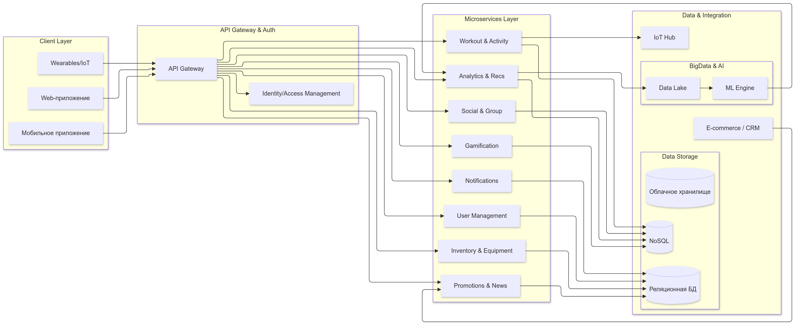
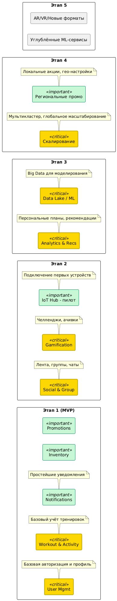

# 6. План поэтапной разработки и расширения системы

План разработан с учётом необходимости раннего выхода на рынок (MVP), а также долгосрочного развития приложения. Каждый этап разбит на несколько подэтапов, в которых можно использовать гибкие методологии (Scrum/Kanban).

## Этап 0: Подготовка и формирование требований

1. Сбор и уточнение требований
   - Исследование рынка, потребностей потенциальных пользователей (включая профессионалов, любителей, детей).
   - Приоритизация функций (must-have vs. nice-to-have).
2. Формирование команды
   - Назначение ответственных за архитектуру, мобильную и веб-разработку, QA, DevOps, аналитику и т.д.
3. Определение целевых показателей (KPIs)
   - Количество установок, активных пользователей, процент переходов в магазин, ROI от промоакций, ретеншн.

**Критически важные компоненты**:

- *Формирование чёткого видения* (Vision/Scope)
- *Согласование бизнес-требований* со стейкхолдерами

## Этап 1: MVP — базовый функционал

1. Регистрация и авторизация пользователей
   - User Management Service: простые механизмы (email/пароль), базовая интеграция с социальными сетями (опционально).
   - Минимум настроек приватности (кто может видеть мои тренировки).
2. Учёт тренировок и личный кабинет
   - Workout & Activity Service: фиксация основных параметров тренировки (время, дистанция).
   - Просмотр личных результатов, сравнение с предыдущими своими тренировками.
3. Упрощённая интеграция с e-commerce
   - Возможность перехода в фирменный интернет-магазин без повторной авторизации (single sign-on).
4. Базовая аналитика
   - Статистика (количество тренировок в неделю, суммарная дистанция).
   - Без продвинутых ML-моделей, но с базовыми сравнительными графиками.

**Критически важные компоненты** (на этом этапе):

- **User Management** – надёжность хранения и безопасность данных о пользователях.
- **Workout & Activity** – стабильность и корректность сбора ключевых метрик (без этого пользователи не смогут полноценно пользоваться приложением).
- **Интеграция с магазином** – чтобы сразу продемонстрировать ценность покупки товаров внутри экосистемы.

**Цель**: обеспечить запуск первой версии (MVP), начать собирать пользовательские данные и обратную связь, проверить гипотезы о востребованности приложения.

## Этап 2: Расширение социальной и геймификационной части

1. Функционал групп и сообществ
   - Создание и поиск групп по интересам, видам спорта, локации.
   - Лента активности (посты, лайки, комментарии).
2. Геймификация
   - Система достижений, очков, рейтингов.
   - Первые челленджи (например, пробежать 10 км за неделю).
3. Уведомления и социальные взаимодействия
   - Push-уведомления о достижениях друзей, упоминаниях в комментариях, приглашениях в группы.
   - Возможность настраивать уровень уведомлений.
4. Пилотная интеграция с IoT-устройствами
   - Подключение популярных фитнес-трекеров для автоматического импорта данных (пульс, шаги).

**Критически важные компоненты**:

- **Social & Group Service** – правильная организация сообществ и ленты активности, чтобы вовлекать пользователей.
- **Gamification Service** – реализация балльной системы, челленджей, лидербордов; важна правильная логика, чтобы система была мотивирующей, а не отталкивающей.
- **Notifications Service** – стабильная рассылка push, email, т.к. социальная составляющая во многом держится на своевременной связи.

**Цель**: повысить вовлечённость пользователей, создать «спортивное комьюнити» вокруг приложения и бренда.

## Этап 3: Подключение аналитики и рекомендаций

1. Big Data инфраструктура
   - Организация Data Lake (хранилище сырых данных о тренировках, активности, кликах, покупках).
   - Настройка потоковой обработки (Kafka/Flink/Spark Streaming) для анализа данных в реальном времени.
2. Персонализация
   - ML-модели рекомендаций тренировочных планов (учёт целей пользователя, его прогресса, локации).
   - Рекомендации по покупке экипировки (например, если у пользователя пробег в текущих кроссовках достиг 300+ км).
3. Сравнительные отчёты и расширенная статистика
   - Сравнение своих результатов не только с прошлыми тренировками, но и с другими любителями в регионе, профессиональными спортсменами.
   - Гибкая фильтрация (возраст, пол, уровень подготовки).

**Критически важные компоненты**:

- **Analytics & Recommendations Service** – корректные рекомендации повышают доверие пользователей и стимулируют покупки.
- **Big Data платформа** (Data Lake, ETL/ELT-система) – основа для хранения и обработки больших объёмов данных.
- **Безопасность и анонимизация** – при сборе и анализе спортивных метрик важна защита персональных данных, соответствие GDPR, локальным законам.

**Цель**: обеспечить интеллектуальную составляющую, сделать продукт уникальным и полезным для пользователя (персональные планы, актуальные рекомендации).

## Этап 4: Масштабирование и глобальное внедрение

1. Географическая экспансия
   - Развёртывание в нескольких регионах/облачных провайдерах (AWS, Azure, GCP, Yandex, VK), использование CDN для быстрой доставки контента.
   - Локализация интерфейса на ключевые языки.
2. Обеспечение высоких нагрузок
   - Горизонтальное масштабирование микросервисов, использование Kubernetes, сервис-меш (Istio/Linkerd).
   - Отказоустойчивость: репликация БД, кластеризация.
3. Усиление системы промоакций
   - Возможность проводить крупные онлайн-соревнования, массовые челленджи (десятки тысяч участников).
   - Гибкая интеграция с CRM/ERP (совместные акции, глубокий анализ лидов).
4. Усиленные меры безопасности
   - Сертификация по ISO 27001, соответствие GDPR, локальным требованиям (например, Роскомнадзор, HIPAA при работе с биометрическими показателями).

**Критически важные компоненты**:

- **Инфраструктура масштабирования** (DevOps, CI/CD) – для оперативного реагирования на увеличение нагрузки.
- **Promotions & News Service** – «массовость» при проведении глобальных соревнований и акций.
- **Региональный комплаенс** – тонкие настройки хранения данных, шифрование.

**Цель**: стабильная работа приложения при любом количестве пользователей по всему миру, укрепление лидерских позиций бренда.

## Этап 5: Дальнейшее развитие и поддержка

1. Углублённые ML-сервисы
   - Прогнозы перетренированности, рекомендации по питанию (в партнёрстве с нутрициологами).
   - Анализ эмоционального состояния (при наличии биосенсоров).
2. Эволюция монетизации
   - Премиум-функции, подписки на расширенный функционал, эксклюзивные виртуальные тренировки с «звёздами» спорта.
   - Реферальные программы, партнёрства (отели, туристические агентства).
3. Новые каналы взаимодействия
   - Интеграция с VR/AR-девайсами (виртуальные тренировки).
   - Расширенная платформа для офлайн-ивентов, спортивных лагерей.

**Критически важные компоненты**:

- **Гибкая архитектура** – возможность добавлять новые сервисы или модули без переделки ядра.
- **Мониторинг качества данных** – при сложных ML-моделях крайне важно, чтобы данные были корректными и полноценными.

**Цель**: сохранить инновационное лидерство, извлечь максимум из богатого массива данных, предлагать пользователям всё более персонализированные и мотивирующие сервисы.

# 6.1. Анализ критически важных компонентов

1. **User Management (Управление пользователями)**
   - Центр аутентификации и авторизации.
   - Крайне важно соблюдать безопасность и отказоустойчивость: любая компрометация аккаунтов подорвёт доверие к бренду.
2. **Workout & Activity Service (Учёт тренировок)**
   - Ядро всего приложения: без корректной фиксации метрик (время, дистанция, пульс и т.д.) теряется ценность платформы.
   - Оптимизация записи данных (особенно при массовых соревнованиях).
3. **Social & Group Service + Notifications**
   - При сбоях в социальной части (пропадающие посты, задержки уведомлений) пользователи теряют интерес, вовлечённость падает.
   - Важно обеспечить real-time взаимодействие и удобный интерфейс общения.
4. **Gamification Service (Геймификация)**
   - Если баллы, уровни и челленджи будут работать неправильно или несправедливо, это вызовет негатив у спортсменов.
   - Продуманная система вознаграждений мотивирует и удерживает пользователей.
5. **Analytics & Recommendations (Аналитика и рекомендации)**
   - Высокая ценность рекомендаций: пользователи хотят персональный подход. Ошибочные советы могут вызывать разочарование и даже травмы при некорректной нагрузке.
   - Безопасность и анонимизация, т.к. речь идёт о данных, частично связанных со здоровьем.
6. **Promotions & News (Промо и новости)**
   - Ключ к повышению продаж и интеграции с e-commerce.
   - Ошибки в таргетированных акциях приводят к недовольству пользователей или к упущенной прибыли.
7. **Data & Infrastructure (Хранилища, облака, DevOps)**
   - Правильно спроектированная инфраструктура обеспечивает масштабирование, без которого приложение не выдержит пиков.
   - Интеграция с IoT-устройствами, Big Data и несколькими облаками требует грамотной оркестрации, мониторинга и логирования.

# 6.2. Соотнесение с планом поэтапной разработки

Ранее развитие приложения было поделено на несколько этапов:

1. **Этап 0**: Подготовка и планирование.
2. **Этап 1 (MVP)**: Базовые функции: регистрация, учёт тренировок, упрощённая интеграция с магазином.
3. **Этап 2**: Социальная часть (группы, геймификация), пилот IoT.
4. **Этап 3**: Big Data, персональные рекомендации, продвинутая аналитика.
5. **Этап 4**: Масштабирование и глобальное внедрение, промоакции.
6. **Этап 5**: Дальнейшее развитие (премиум-функции, AR/VR, углублённая ML-аналитика).

Упрощённая схема:

## 1. Этап 1 (MVP) на схеме

В MVP наиболее критичны сервисы:

1. **User Management (US)** — регистрация/авторизация.
2. **Workout & Activity (WS)** — базовый учёт тренировок.
3. **Inventory & Equipment (IS)** (в упрощённом виде) — хотя бы возможность показать товары или быстрый переход в e-commerce.
4. **Promotions & News (PS)** — может быть в зачаточной форме (минимальные промоблоки).
5. **Notifications (NS)** — простые push-уведомления (например, «Тренировка завершена»).

На концептуальной схеме в это время **не обязательно** подключать Social & Group (SS), Gamification (GS), а блок Analytics & Recs (AR) может работать в минимальном объёме. Data Lake (DL) и ML-движок тоже, скорее всего, не задействованы.

Именно эти **минимальные сервисы** (US, WS, IS, NS, PS) формируют костяк MVP, через **API Gateway** обмениваются данными с клиентами, а храним информацию в **реляционной БД** для профилей и заказов и **NoSQL** (если нужно сохранить формат тренировок).

**IoT Hub** на первом этапе можно лишь запланировать, но не внедрять, если это не критично.

## 2. Этап 2 (Социальная часть, геймификация)

На схеме «подключаются» полноценные сервисы:

- **Social & Group (SS)**: лента, группы, чаты.
- **Gamification (GS)**: ачивки, челленджи, рейтинги.

Усложняется **Notifications (NS)** за счёт уведомлений о социальных событиях, челленджах.

Появляется **пилотная интеграция** с **IoT Hub** (например, сбор базовых показателей с определённых фитнес-трекеров).

**Data Storage**: всё активнее используем **NoSQL** для хранения соц. данных (посты, лайки, комментарии) и метрик тренировок. Реляционные базы продолжают использоваться для транзакций, профилей, магазинов.

## 3. Этап 3 (Big Data и аналитика)

На уровне схемы начинает активно «включаться» блок **Analytics & Recs (AR)**, тесно связанный с **Data Lake (DL)** и **ML Engine (ML)**.

- Собираем массив данных о тренировках, покупках, соцактивности.
- Включаем стриминг (Kafka/RabbitMQ) для обработки событий в реальном времени.
- **AR** даёт персональные рекомендации (планы тренировок, товары), эти результаты могут отображаться в клиентских приложениях через **API Gateway**.

Дополнительно усиливается **IoT Hub** для полноценной интеграции с популярными устройствами. Растёт нагрузка на **NoSQL** (много данных от сенсоров).

## 4. Этап 4 (Масштабирование, глобальное внедрение)

На схеме те же микросервисы, но **регионально** дублируются (несколько развёртываний).

- **API Gateway** может быть реплицирован в разных регионах, обслуживая локальных пользователей через ближайший узел.
- **Data Storage** масштабируется: несколько экземпляров NoSQL, реляционные базы реплицируются, **Data Lake** распределяется по разным облакам.
- **Promotions & News (PS)** развивается: теперь поддержка региональных акций, локальных новостей.

## 5. Этап 5 (Будущее развитие)

Расширяются **ML Engine**, интеграции (AR/VR), появляется более глубокая аналитика здоровья и спортивных показателей. На схеме это означает дополнительные сервисы или подмодули в **AR**, а также возможные новые сервисы.

# 6.3. Критически важные компоненты и их роль на схеме

Ранее выделяли **критически важные компоненты**:

1. **User Management (US)** – ядро авторизации и профилей.
2. **Workout & Activity (WS)** – основа учёта тренировок.
3. **Social & Group (SS)** + **Notifications (NS)** – социальная вовлечённость, геймификация, приглашения и т.д.
4. **Gamification (GS)** – баллы, челленджи, лидерборды.
5. **Analytics & Recs (AR)** – ключ к персонализации и дальнейшему росту продаж (через подсказки, прогнозы).
6. **IoT Hub** – корректная работа с внешними устройствами.
7. **Data Lake, ML Engine** – глубокая аналитика, постоянное развитие интеллектуальных сервисов.

## 1. Как «критически важные» сервисы работают на концептуальной схеме

- **User Management** (US) находится в микросервисном слое и взаимодействует с **Auth** для выдачи токенов доступа. При сбое в US пользователи не могут зайти в приложение (критично).
- **Workout & Activity** (WS) собирает данные о тренировках (через Gateway) и может дополнительно получать метрики от **IoT Hub** (пульс, GPS). Если WS недоступен, весь учёт тренировок встаёт.
- **Social & Group** (SS) + **Gamification** (GS) — связка, формирующая социальную активность (лента, челленджи). Без неё приложение теряет «соц»–ценность.
- **Notifications** (NS) доставляет пуши/уведомления об успехах, событиях — если он «падает», пользователи перестают получать триггеры и вовлечённость падает.
- **Analytics & Recs** (AR) + **Data Lake** (DL) + **ML Engine** (ML) — критический для персонализации, отсюда идут умные советы, реклама, прогнозы. При сбое «умного ядра» пользователи не получат рекомендации, падает конверсия и интерес.
- **IoT Hub** важен для реального времени и точного сбора метрик, особенно для продвинутых спортсменов. Без него большинство функций по отслеживанию датчиков будут недоступны.

Соответственно, все эти блоки «живут» в микросервисном слое (за исключением Data Lake и ML, которые находятся в Big Data сегменте) и связаны через **API Gateway** (для клиентской части) и **событийную шину** (внутренняя коммуникация).

# 6.4. Визуальная привязка этапов к схеме

Ниже — условная иллюстрация, показывающая, какие блоки «активируются» или «расширяются» на каждом этапе.

1. **На Этапе 1 (MVP)** запускаются основные «критичные» сервисы (User Mgmt, Workout), а также «важные» — Notifications, Promotions, Inventory.
2. **На Этапе 2** добавляются Social & Group, Gamification, IoT Hub (пока пилот).
3. **На Этапе 3** включаются мощные аналитические модули (Analytics & Recs + Data Lake / ML).
4. **Этап 4** затрагивает «сквозное» масштабирование и расширенные промо.
5. **Этап 5** — будущее развитие: углублённая ML-аналитика, AR/VR и т.д.

# 6.5. Вывод

Таким образом, **концептуальная схема** (клиентский слой, API Gateway, набор микросервисов, IoT- и Big Data-интеграция) **прямо коррелирует** с **поэтапным планом разработки**:

1. **На ранних этапах** (MVP) запускается лишь ограниченная часть сервисов (User Management, Workout & Activity, базовые уведомления и промо).
2. **Дальше** подключаются социальные и геймификационные компоненты (Social, Gamification) и проводится **IoT-пилот**.
3. **Затем** идёт фокус на **аналитику и рекомендации** (Big Data, ML).
4. **После** этого — **глобальное масштабирование** и продвинутая система региональных промоакций.
5. **В будущем** появляются расширенные ML-сервисы, AR/VR-функции и любая новая функциональность, которую легко интегрировать в микросервисную архитектуру.

Все критически важные компоненты (US, WS, SS, GS, AR, IoT Hub, Notifications, Data Lake) эволюционируют от **простого к сложному**, а их раздельное существование в микросервисном контуре позволяет внедрять новые фичи, исправления и масштабирование независимо, без «разноса» всего приложения.

Такое соответствие планов и схемы гарантирует, что архитектура остаётся согласованной, а команда видит, **где** и **как** разворачивать новые элементы по мере прохождения каждого этапа.
