# Kонцептуальная архитектура приложения, опирающаяся на требования и бизнес-цели.

*В данном разделе выделены основные подсистемы, модули и взаимосвязи между ними, чтобы показать общую логику работы и последующую эволюцию (наращивание функционала, масштабирование и т.д.).*

## Общий обзор

Приложение можно условно разделить на следующие крупные блоки:

1. **Клиентские приложения** (Mobile App, Web-платформа)
2. **API-шлюз и сервисы приложений** (микросервисы, обрабатывающие различные аспекты функционала)
3. **Интеграционный слой** (интеграция со сторонними устройствами, сервисами и корпоративной инфраструктурой)
4. **Подсистема хранения данных** (реляционные и NoSQL-базы, репозиторий для файлов)
5. **Система аналитики и персонализации** (Big Data, ML-модели, рекомендательные модули)
6. **Управление пользователями и безопасностью** (Identity Management, авторизация, шифрование)

Ниже рассмотрим более детально каждый блок и их взаимодействие.

## 1. Клиентские приложения

### 1.1. Мобильное приложение

- **Целевая платформа**: iOS, Android (возможно, HarmonyOS, если важно поддерживать китайский рынок).

- Основной функционал:

  - Регистрация/авторизация
  - Отслеживание тренировок (с учётом данных со встроенных датчиков телефона и/или внешних устройств)
  - Лента активности, чаты, социальные группы
  - Аналитика по тренировкам (личная статистика, сравнения, графики)
  - Магазин и промоакции (интеграция с e-commerce решением компании)
  - Система уведомлений (push-уведомления о событиях: достижения, приглашения в группы, скидки)

### 1.2. Web-приложение (портал)

- Функциональные особенности:

  - Личный кабинет пользователя, общая панель с тренировками и рекомендациями
  - Более детализированные отчёты (графики, сравнения, история покупок)
  - Настройки профиля, управления устройствами, правами доступа
  - Админ-панель для маркетинга (загрузка промоакций, настройка региональной рекламы)
  - Управление сообществами (модерация групп, чат)

### 1.3. Wearables/IoT-устройства

- Для продвинутых функций (пульс, SpO2, шагомер, трекинг маршрутов) важно обеспечить **SDK или API** для умных часов, браслетов (Garmin, Polar, Apple Watch и т.д.) и прочих гаджетов.
- Данные от устройств могут напрямую попадать в **мобильное приложение**, а затем — в облако.

## 2. Слой приложений и микросервисов

Чтобы удовлетворить требования масштабируемости и гибкости, удобно развернуть микросервисную архитектуру в облачной среде (или гибридном варианте). Сервисы могут общаться между собой через **API-шлюз** (Gateway) или **Service Mesh**.

### 2.1. API Gateway

- Главная точка входа для всех клиентских запросов (Mobile/Web)
- Аутентификация/авторизация (можно использовать OpenID Connect, OAuth 2.0)
- Маршрутизация запросов к соответствующим микросервисам
- Рейт-лимиты, кэширование, ограничение доступа

### 2.2. Основные микросервисы

1. **User Management Service**
   - Управление учётными записями (регистрация, профиль, безопасность)
   - Связь с внешними провайдерами соцсетей (при желании авторизовать через Facebook, Google и т.д.)
2. **Workout & Activity Service**
   - Хранение и обработка данных о тренировках
   - Логика подсчёта достижений, статистики, прогресса
   - Формирование сравнительных показателей (с прошлым результатом, с другими пользователями)
3. **Social & Group Service**
   - Управление группами по интересам, геолокации, видам спорта
   - Лента активности, посты, комментарии, лайки
   - Логика формирования рекомендованных групп и поиска партнёров по тренировкам
4. **Gamification Service**
   - Система достижений, очков, виртуальных наград
   - Создание и управление челленджами (еженедельные, сезонные)
   - Подсчёт рейтингов и лидербордов
5. **Inventory & Equipment Service**
   - Управление спортивным инвентарём (запись модели обуви, пробег, снаряды)
   - Подсказки по замене инвентаря, рекомендация новых товаров
   - Интеграция с e-commerce решением (переход к покупке)
6. **Promotions & News Service**
   - Управление акциями, скидками и спортивными новостями
   - Гранулярная настройка таргетинга (регион, тип спортсмена)
   - Выдача промо-блоков во фронтенде
7. **Notifications Service**
   - Рассылка push-уведомлений, email, SMS (в зависимости от предпочтений пользователя)
   - Поддержка разных каналов доставки (через Firebase Cloud Messaging, Apple Push Notification и т.п.)
8. **Analytics & Recommendations Service** (пересекается с Big Data/ML инфраструктурой)
   - Собирает информацию о тренировках, покупках, активности пользователей
   - Формирует личные рекомендации по планам тренировок, товарам, сообществам
   - Строит ML-модели для персонифицированных предложений

## 3. Интеграционный слой

### 3.1. Сторонние устройства и сервисы

- **IoT Hub / Data Ingestion**: сервис, который принимает потоки данных от внешних фитнес-устройств и wearables.
- **API-партнёров**: агрегаторы данных (Google Fit, Apple HealthKit) для синхронизации тренировок, шагов, показателей здоровья.

### 3.2. Взаимодействие с корпоративной инфраструктурой

- **E-commerce платформа**: обмен данными (товары, цены, остатки, заказы).
- **CRM/Marketing системы**: для запуска email-рассылок, таргетированных предложений, A/B-тестов.
- **ERP**: если потребуется связать статистику использования/продаж с производством товаров (для долгосрочного планирования).

### 3.3. Внешние социальные сети

- Опционально, если нужен шеринг результатов (Facebook, Twitter, Instagram).
- OAuth для авторизации (завести учётную запись через соцсети).

## 4. Подсистема хранения данных

В зависимости от типа данных и нагрузки можно использовать разные виды хранилищ.

1. Реляционная БД

    (PostgreSQL, MySQL, MS SQL)

   - Для хранения профилей пользователей, транзакционных данных, заказов, финансовой информации.

2. NoSQL БД

    (MongoDB, DynamoDB, Couchbase)

   - Для быстрой записи больших объёмов данных о тренировках, активности пользователей, логов.
   - Гибкая структура для различных типов метрик.

3. Time-Series DB

    (InfluxDB, TimescaleDB)

   - Для хранения временных рядов (пульс, темп бега, показания сенсоров).

4. Кэш

    (Redis, Memcached)

   - Для ускорения выдачи часто запрашиваемых данных (профилей, стилей оформления, частых запросов).

5. Облачное хранилище

    (S3, Azure Blob, Google Cloud Storage)

   - Для сохранения медиафайлов (фото, видео тренировки, изображения для промо).

## 5. Система аналитики и персонализации

### 5.1. Потоковая и batch-обработка данных

- **Data Lake** (например, S3 или HDFS) для хранения «сырых» данных о тренировках, социальных взаимодействиях.
- **Поточное ядро** (Kafka, Pulsar) для обработки событий в реальном времени (запуск мгновенных рекомендаций, уведомлений).
- **Spark / Flink** для batch- и стриминг-обработки больших объёмов данных.

### 5.2. ML-модели и рекомендации

- Построение моделей предсказания:

  - Спрогнозировать, когда пользователю понадобятся новые кроссовки (исходя из пробега)
  - Какие виды тренировок наиболее вероятны для конкретного георегиона или группы
  - Личная нагрузка и расписание тренировок (диагностика перетренированности)

- Развёртывание моделей в микросервисе 

  Analytics & Recommendations  :

  - Обработка запросов от фронтенда: «Посоветуй мне план тренировок на неделю»
  - Интерфейс (REST/gRPC) для подгрузки данных из Data Lake.

## 6. Управление пользователями и безопасность

### 6.1. Identity Management (IdP)

- Можно реализовать на базе Keycloak, Auth0 или аналогичных решений.
- Поддержка многофакторной аутентификации (2FA, push-аппрув).
- Гибкие настройки приватности (кто может видеть мой профиль, тренировки, инвентарь).

### 6.2. Шифрование и соответствие нормам

- Шифрование PII-данных (личные данные) в покое (at-rest) и в трансляции (in-transit).
- Соответствие **GDPR** (если затрагивается ЕС), **CCPA** (Калифорния), возможно, **ФЗ-152** (Россия) или иные локальные законы о данных.
- Логирование действий пользователей (audit trail) с сохранением в защищённом месте.

## Пример взаимодействия (Use Case)

1. **Пользователь заходит в мобильное приложение** и авторизуется через API Gateway.
2. **Gateway** перенаправляет запрос на **User Management Service**, который возвращает токен аутентификации.
3. Когда пользователь запускает тренировку (запись маршрута, пульса), данные поступают из приложения (и/или IoT-устройства) в **Workout & Activity Service**.
4. Параллельно эти данные через шину (Kafka) могут копироваться в **Analytics & Recommendations Service** для реального времени рекомендаций или анализа исторических данных.
5. По завершении тренировки пользователь получает **push-уведомление** (из **Notifications Service**) с анализом результатов + предложением купить, например, новые кроссовки, если текущие «пробежали» уже 500+ км (логика **Inventory & Equipment Service + Promotions**).
6. Информация о новых скидках или мероприятиях (забег, марафон) передаётся в приложение через **Promotions & News Service**.
7. Пользователь может поделиться результатами в своих группах (через **Social & Group Service**), где его друзья комментируют и «лайкают» достижение.

## Масштабирование и надёжность

- **Облачные провайдеры**: поскольку у компании нет одного выбранного провайдера, можно выстраивать архитектуру, используя Kubernetes + Terraform/Ansible, чтобы развернуть компоненты у разных облачных поставщиков (AWS, Azure, Google Cloud) либо в гибридном режиме.
- **Горизонтальное масштабирование** микросервисов: при росте нагрузки (пиковые соревнования или акции) автоматически поднимаются дополнительные инстансы.
- **Мульти-региональная структура** для быстрой доставки контента (CDN, edge-сервисы), а также для требования отказоустойчивости и уменьшения задержек.

## Альтернативные подходы и перспективы

1. **Монолит с последующей разбивкой**: Подходит для быстрого старта MVP, но сложнее в масштабировании. Обычно лучше сразу закладывать микросервисную модель, если ожидается высокая нагрузка и различные потоки данных.
2. **Serverless-архитектура**: Можно использовать AWS Lambda/Azure Functions/GCP Cloud Functions для событийной логики (обработка уведомлений, отдельных триггеров). Но при большом объёме постоянных запросов микросервисы будут выгоднее.
3. **Event-driven** с микросервисами: Использование очередей/шины (Kafka/ActiveMQ/RabbitMQ) для взаимодействия сервисов и реализации гибкой геймификации, стриминговой аналитики.
4. **Low-code/BPM-платформы**: Для маркетинговых кампаний, тонкой настройки бизнес-процессов без написания большого количества кода. Однако для спортивного приложения, вероятно, придётся писать достаточно кастомной логики.

## Итог

Данная **концептуальная архитектура** ориентируется на гибкость, масштабируемость и социальную составляющую. Ключевые идеи:

1. Микросервисный подход с API Gateway,
2. Интеграционный слой для подключения IoT и партнёрских сервисов,
3. Облачные решения для хранения данных,
4. Мощная аналитика (Big Data, ML),
5. Безопасность и поддержка разных региональных норм.

Такое решение позволит организовать функционал от элементарного учёта тренировок до социальных челленджей, рейтингов и персонализированных рекомендаций, сохраняя при этом высокую надёжность и скорость отклика для миллионов потенциальных пользователей по всему миру.

Таким образом, описанная концептуальная архитектура послужит основой для детальной проработки (логической и физической схем) и поможет задать вектор для распределённой команды разработчиков, дизайнеров и специалистов по инфраструктуре.

### Краткие пояснения к схеме

1. **Client Layer**:
   - Мобильные приложения, веб-портал, а также возможные SDK для носимых и IoT-устройств.
2. **API Gateway & Auth**:
   - Единая точка входа (Gateway), где происходит авторизация (OAuth/OIDC).
   - Перенаправляет запросы к нужным микросервисам, обеспечивает безопасность, кэширование, рейт-лимиты и др.
3. **Microservices Layer**:
   - **User Management Service**: хранение и управление профилями, регистрация, аутентификация.
   - **Workout & Activity Service**: логика учёта тренировок, хранение ключевых метрик, сравнение результатов.
   - **Social & Group Service**: социальные функции (группы, лента, комментарии).
   - **Gamification Service**: система достижений, челленджей, рейтингов.
   - **Inventory & Equipment Service**: учёт экипировки, пробег обуви, рекомендации по замене.
   - **Promotions & News Service**: гибкое управление промоакциями и новостями, таргетинг по регионам.
   - **Notifications Service**: рассылка уведомлений (push, e-mail, SMS) пользователям.
   - **Analytics & Recommendations Service**: сбор данных, ML-модели (предложение персонализированных тренировочных планов, товаров и т.п.).
4. **Data & Integration**:
   - **Data Storage**: реляционные (RDB) базы для транзакционных данных, NoSQL/Time Series для больших объёмов и метрик, объектное хранилище для файлов (FileRepo).
   - **Big Data & AI**: Data Lake (DL) для хранения больших массивов событий, логов, необработанных данных; ML-движок (Spark/Flink или аналог) для моделирования и предиктивной аналитики.
   - **IoT Hub**: точка интеграции с внешними фитнес-устройствами, датчиками.
   - **E-commerce / CRM**: взаимодействие с корпоративным магазином и маркетинговой платформой.
   - **External Social Networks**: возможность «шеринга» результатов, аутентификации или получения новостей из внешних соцсетей.

Таким образом, данная **концептуальная архитектура** гибко покрывает все основные требования — от социальной составляющей и учёта тренировок до геймификации, интеграции с устройствами и системами компании.
